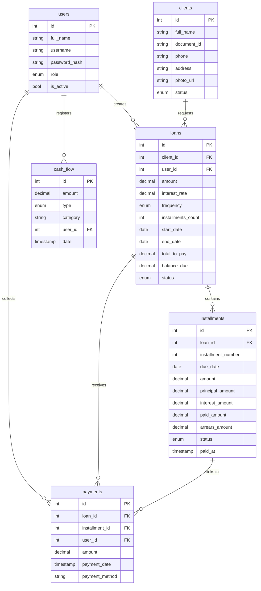

# Entity Relationship Diagram - Prestacontrol PWA

```mermaid
erDiagram
    users ||--o{ loans : "creates"
    users ||--o{ payments : "collects"
    users ||--o{ cash_flow : "registers"
    clients ||--o{ loans : "requests"
    loans ||--o{ installments : "contains"
    loans ||--o{ payments : "receives"
    installments ||--o{ payments : "links to"

    users {
        int id PK
        string full_name
        string username
        string password_hash
        enum role
        bool is_active
    }

    clients {
        int id PK
        string full_name
        string document_id
        string phone
        string address
        string photo_url
        enum status
    }

    loans {
        int id PK
        int client_id FK
        int user_id FK
        decimal amount
        decimal interest_rate
        enum frequency
        int installments_count
        date start_date
        date end_date
        decimal total_to_pay
        decimal balance_due
        enum status
    }

    installments {
        int id PK
        int loan_id FK
        int installment_number
        date due_date
        decimal amount
        decimal principal_amount
        decimal interest_amount
        decimal paid_amount
        decimal arrears_amount
        enum status
        timestamp paid_at
    }

    payments {
        int id PK
        int loan_id FK
        int installment_id FK
        int user_id FK
        decimal amount
        timestamp payment_date
        string payment_method
    }

    cash_flow {
        int id PK
        decimal amount
        enum type
        string category
        int user_id FK
        timestamp date
    }
```
